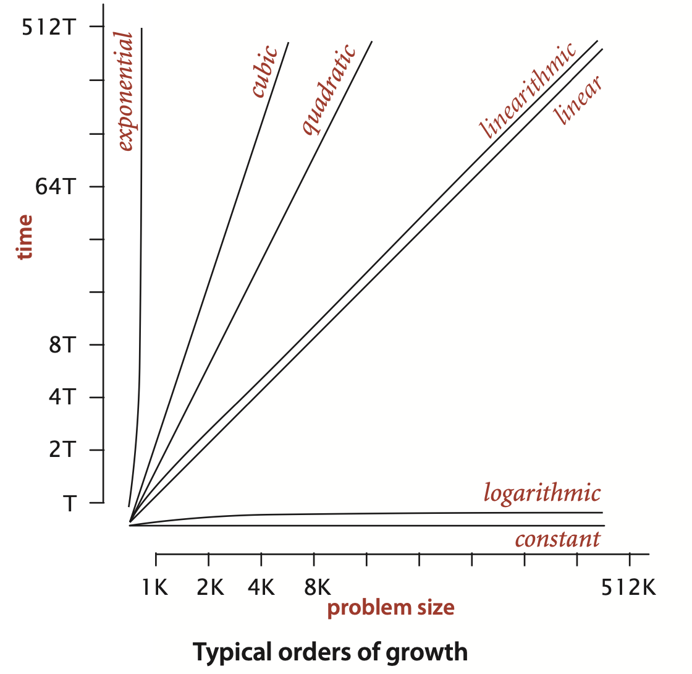

- [Steps of developing a mathmatical model for running time](#steps-of-developing-a-mathmatical-model-for-running-time)
- [Common Order of growth](#common-order-of-growth)
- [Order of growth for common classic algorithms](#order-of-growth-for-common-classic-algorithms)
  - [Binary search](#binary-search)

# Steps of developing a mathmatical model for running time

- Determine `input model`
- Identify `inner loop`
- Define `cost model` inside the `inner loop`
- `anylasis`: determine the order of growth

# Common Order of growth

For input $N$, the running time is $T$, $T=f(N)$:

- `constant`: $N$ has no effect on $T$
- `logarithmic`: $T=log(N)$
- `linear`: $T=aN$, where $a$ is constant
- `linearithmic`: $T=Nlog(N)$
- `quadratic`: $T=N^2$
- `cubic`: $T=N^3$
- `exponential`: $T=2^N$

 

Common order of growth

# Order of growth for common classic algorithms

## Binary search

Let $T$ be the running time of binary search, $N$ be the size of the ordered array. To find specific key, the worst case running time is:
$$T=log_2N+1$$